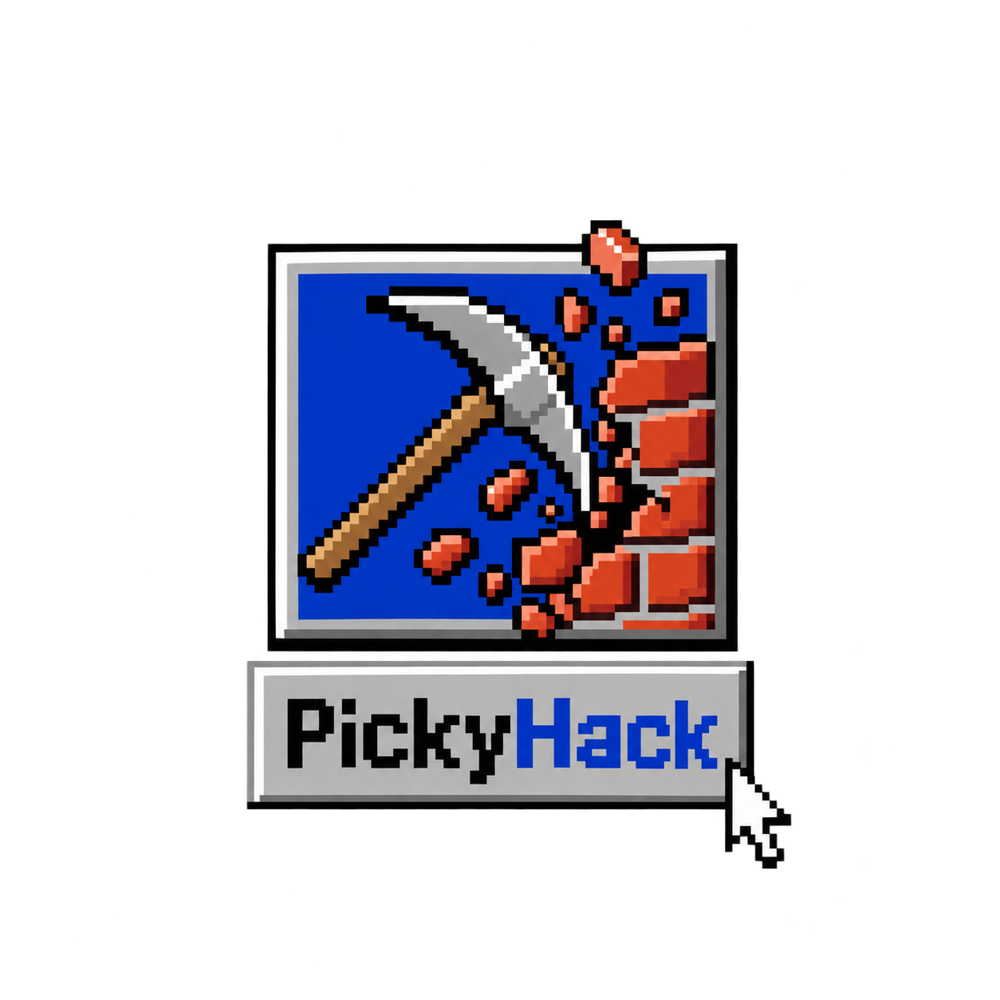

<p align="center">
  
</p>

# PickyHack — Autonomous Pentest Agent & Context Harness

> **"Stateless by default. Context-driven by design."**  
> *Production-grade offensive security copilot with transparent context budgeting, autonomous execution backends, and zero vendor lock-in.*

[](LICENSE)
[](tests/)
[](benchmarks/context-engine/RESULTS.md)
[](benchmarks/context-engine/RESULTS.md)
[](#modern-chat-first-user-experience)

---

## What is PickyHack?

**PickyHack** is an autonomous offensive security agent and proprietary **Context Harness**. 

Instead of treating the AI as an unmanaged conversational chatbot where scanner outputs fill the context window with repetitive noise, PickyHack decouples reasoning from state:
- **Canonical Truth in `ProjectState`:** Assets, open ports, vulnerabilities, evidence logs, tasks, and notes are tracked deterministically in a structured schema.
- **Stateless Model Invocations:** Every prompt is assembled on-the-fly into a mathematically optimized, budget-constrained context packet.
- **Model-Agnostic Replay:** Switch seamlessly between OpenAI (`gpt-4o`), Anthropic (`claude-3-5-sonnet`), Google Gemini (`gemini-2.0-flash`), or local models (`ollama/deepseek-r1`) without losing a single finding or repeating recon.

```text
Any Model Provider (Cloud APIs • Local Air-Gapped Runtimes • Custom Endpoints)
                                │
                                ▼
            ┌─────────────────────────────────────────┐
            │                PICKYHACK                │
            │                                         │
            │        Proprietary Context Harness      │
            │  ─────────────────────────────────────  │
            │   Reactive ProjectState   ContextEngine │
            │   Autonomous AgentLoop    RiskEngine    │
            │   Tool Registry (Nmap)    Attack Graph  │
            │   Remote Kali via SSH     CISA KEV      │
            │   Portable Snapshot       Client Report │
            └─────────────────────────────────────────┘
                                │
                                ▼
                         SECURITY OPERATOR
```

---

## Modern Chat-First User Experience

PickyHack provides a modern, distraction-free conversational canvas:

```text
PickyHack Application Shell
│
├── Sidebar
│   ├── Active Engagement & Project Switcher
│   ├── Chat Sessions & Multi-Turn Threads
│   ├── Targets & Scope Modal
│   ├── Findings & Vulnerabilities Registry
│   ├── Autonomous Task Tree
│   ├── Notes & Evidence Scratchpad
│   ├── Attack Graph & Exploit Chains
│   ├── CISA KEV Live Threat Intelligence
│   ├── Formal Client Deliverables
│   └── Backend Indicator & Dual-Theme Switcher
│
├── Main Chat Canvas
│   ├── Scope & Active Target Indicator
│   ├── Message Stream (User, AI, Streaming Reasoning)
│   ├── In-Line Tool Execution Cards (Status, Command, Duration)
│   ├── Collapsible Syntax-Highlighted Terminal Output
│   ├── Safety Approval Gates (Operator Consent for elevated risks)
│   ├── Discovered Finding Prompts
│   └── Floating Composer (Attachment Shelf, Compare, Autonomous Mode Toggle)
│
└── Context Drawer (Collapsible Inspector)
    ├── Live Token Budget Headroom Meter (e.g. 4,210 / 8,192 tokens)
    ├── Target & Scope Summary
    ├── Active Task & Next Recommended Action (NRA)
    ├── Selected vs Pruned Context Breakdown
    ├── Launch Context Debugger (Visual Utility Scoring & Replay)
    └── Export / Import Portable Snapshots (.pickycontext.json)
```

### Visual Themes
- **PickyTahoe (Default):** Sleek, modern macOS Tahoe-inspired design with glassmorphism, refined typography (`Inter` / system-ui), card depth, and dark mode.
- **Picky98 (Optional Retro Skin):** Classic Windows 98 teal `#008080`, navy titlebars, and 3D bevels applied over the exact same modern chat layout without modifying functionality.

---

## The Context Engine: Measurable Advantage

PickyHack features an empirically benchmarked **Context Engine V2** that solves context window bloat:

### 1. Multi-Factor Utility Scoring
Every state item $i$ is scored for query $q$ and active task $s$:

$$U(i, q, s) = 0.45 \cdot R(i, q) + 0.35 \cdot C(i) + 0.15 \cdot F(i) - 0.20 \cdot P(i, s)$$

- **$R(i, q)$ (Relevance):** Keyword and entity matching (CVEs, IPs, ports, tool names).
- **$C(i)$ (Criticality):** Vulnerability severity, verified PoCs, and confirmed findings.
- **$F(i)$ (Freshness):** Temporal decay of observation recency.
- **$P(i, s)$ (Penalty):** Deduplication penalty for redundant host services.

### 2. Token Knapsack Allocation
The engine strictly packs candidates into the chosen budget ($1\text{k} - 32\text{k}$ tokens), prioritizing high-utility findings while pruning raw log bloat.

### 3. Empirical Benchmark Results
Evaluated across four real-world security scenarios (Perimeter RCE, API Gateway Exposure, AD Kerberoasting, CI/CD Exploitation):

| Metric | Traditional Chat Dump | PickyHack Context Engine | Benefit |
| :--- | :--- | :--- | :--- |
| **Average Token Count** | 3,699 tokens | 1,739 tokens | **-53% Token Reduction** |
| **Critical Finding Recall** | 100% | 100% | **Zero Information Loss** |
| **Harness Latency** | N/A | < 1 ms | **Real-Time Execution** |
| **Cost / 1k Queries** | $9.25 | $4.35 | **-53% API Cost Savings** |

*Reproduce benchmarks anytime via `node benchmarks/context-engine/runner.js`.*

---

## Autonomous Tool Runtime & Safety

### Pluggable Execution Backends
- **Local Backend:** Executes directly on the host or local Python daemon (`src/backend/server.py`).
- **Remote SSH Backend:** Connects to dedicated remote Kali Linux or Parrot OS instances via Paramiko.
- **Docker Backend:** Spawns isolated container sandboxes.

### Built-in Tool Registry
- `nmap`: Network port scanning and banner grabbing.
- `nuclei`: Vulnerability template and CVE verification.
- `ffuf`: High-speed directory and parameter fuzzing.
- `curl`: HTTP/S banner and response inspection.
- `browser_action`: Headless web automation (navigation, DOM extraction, screenshot evidence capture).
- `dns_lookup`: DNS resolution (A, AAAA, MX, TXT, NS).
- `shell`: Strictly gated command execution.

### Risk & Consent Engine (`RiskEngine`)
Tools are classified by risk (`READ`, `LOW`, `MEDIUM`, `HIGH`, `CRITICAL`). When high-risk or exploit commands are planned, execution pauses and an **Operator Approval Gate** appears inline in the chat stream with `[Authorize Execution]` and `[Reject]` controls.

---

## Portable Context Snapshots (`.pickycontext.json`)

Export the complete engagement state at any time:
- **Automated Secret Redaction:** API keys, passwords, and private SSH keys are stripped automatically before serialization.
- **Cross-Operator Collaboration:** Share `.pickycontext.json` with a teammate to reconstruct findings, evidence, and task trees instantly.
- **Model Handoff:** Hand over an assessment started on `claude-3-5-sonnet` to a local air-gapped `deepseek-r1` with zero setup.

---

## Quick Start & Installation

### Prerequisites
- Node.js 18+ (tested on Node.js v26.8.1)
- Python 3.9+ (for execution daemon)

### 1. Clone & Install
```bash
git clone https://github.com/kalidraco/pickyhack.git
cd pickyhack
npm install
```

### 2. Launch Local Daemon & Workstation
```bash
# Start backend daemon and open web UI at http://localhost:8088
python3 src/backend/server.py
```

Open `http://localhost:8088` in your browser.

### 3. Run Automated Quality & Benchmark Suites
```bash
# Run all 16 unit and integration test suites
npm test

# Run Context Engine benchmark suite
node benchmarks/context-engine/runner.js

# Verify static code integrity
npm run lint
```

---

## Documentation

- [Context Engine Specification](docs/CONTEXT_ENGINE.md) — Mathematical utility scoring, token budgeting, and replay.
- [Benchmark Results](docs/BENCHMARKS.md) — Empirical methodology and reproducibility.
- [Tool Runtime & Backends](docs/TOOLS.md) — Tool registry schema, execution backends, and safety gates.
- [Audit & Architectural Hardening](docs/AUDIT.md) — Comprehensive codebase audit and security posture.

---

## License

MIT License. Designed and maintained for ethical offensive security professionals, penetration testers, and vulnerability researchers.
